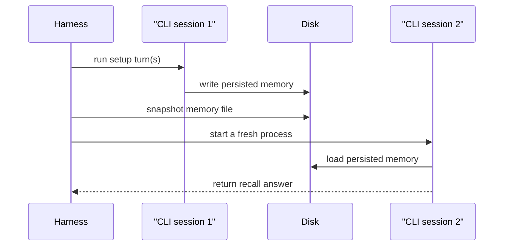

# Conversational Memory Comparison

This submission compares three memory modes for the starter Deep Agents chat app:

- `none`: no long-term memory
- `facts`: structured facts persisted on disk
- `summary`: one latest coherent cross-session summary persisted on disk

The core requirement for this take-home is **cross-conversation persistence**. Same-chat recall is not long-term memory.

## BLUF

- This repo compares three memory strategies for a chat agent and evaluates the real requirement for this take-home: cross-session persistence, not same-session transcript recall.
- `none` is the control. `facts` stores structured latest-state memory plus event history. `summary` stores one compact latest-state narrative and only adds targeted temporal history for explicit prior-state questions.
- Recommendation: ship `facts` as the MVP. It is the easiest strategy to inspect, validate, and update correctly when user facts change or contradict earlier turns.
- LangChain resolves and invokes the configured chat models, Deep Agents provides the runtime, and the application code owns prompt injection, persistence, and memory update semantics.

## Quick Start

### 1. Install and configure

```bash
uv sync
cp .env.example .env
```

Add the provider key for the model path you plan to run. The documented default review flow, CLI, harness, and LLM extractor benchmark path use Anthropic-backed models, so the simplest default setup is `ANTHROPIC_API_KEY`. If you only set an OpenAI or Google key, also override the model selection to a matching provider.

```bash
ANTHROPIC_API_KEY=...
OPENAI_API_KEY=...
GOOGLE_API_KEY=...
```

### 2. Preferred reviewer path: launch the UI

```bash
uv run review-demo
```

This is the primary reviewer path. It:

- starts the FastAPI backend on `127.0.0.1:8000`
- starts the Vite frontend on `127.0.0.1:3000`
- installs frontend dependencies automatically on first run if needed
- opens the browser to the review UI automatically
- keeps both processes attached to the same terminal so they can be stopped with `Ctrl+C`

If you do not want the script to open a browser tab automatically:

```bash
uv run review-demo --no-open
```

Once the UI opens, the shortest review path is:

1. choose a scenario preset
2. keep the default model or switch it before the first run
3. click `Run preset`
4. compare `none`, `facts`, and `summary`
5. optionally continue the restarted session inside any panel

In the default UI flow, `Run preset` starts from blank saved memory, runs the scripted setup turns, restarts the session, and then asks two recall questions. Every preset now includes an overwrite during setup, so the restarted thread checks both the current state and a prior-state question. In `facts`, the latest value should appear in `facts.json` and the overwritten value should appear in `facts_events.jsonl`. In `summary`, `summary.json` should reflect the latest coherent state rather than an appended history.

In the UI, the `facts` panel now shows both:

- `facts.json`: the latest structured state
- `facts_events.jsonl`: the parsed append-only history of fact changes

The `summary` panel continues to show only `summary.json`.

### 3. Alternative reviewer path: run the comparison harness

```bash
uv run python harness.py
```

Use this when you want the full scripted evidence set rather than the browser UI. The harness:

- automatically runs all 5 scenarios
- runs all 3 memory modes for each scenario: `none`, `facts`, `summary`
- runs 2 fresh CLI sessions per scenario/mode pair
- runs scenario/strategy jobs in parallel by default
- streams progress into the terminal as it goes
- writes transcripts, memory snapshots, and summary artifacts under:

```text
artifacts/harness_results/sample_run/
```

By default it uses:

- chat model: `anthropic:claude-opus-4-6`
- facts extractor mode: `hybrid`
- facts extractor model: `anthropic:claude-haiku-4-5`
- parallel jobs: `15` (full current scenario-by-strategy matrix)

Unless you override `--model`, this path uses the default Anthropic chat model.

### 4. Run the regression tests

Recommended in sandboxed or reviewer environments:

```bash
env UV_CACHE_DIR=/tmp/uv-cache uv run pytest -q
```

If your environment allows the default `uv` cache path, the shorter equivalent is:

```bash
uv run pytest -q
```

### 5. Manual CLI path

```bash
uv run chat --memory-type facts --user-id demo_user
```

Use the CLI when you want to inspect one memory mode directly rather than compare the three modes side by side.
Unless you pass `--model`, this path uses the default Anthropic chat model.

## What “memory” means here

There are two separate mechanisms in this project:

1. **Current-session transcript**
   - The app passes the current `messages` list to the agent.
   - This is why `none` can still answer follow-up questions in the same session.

2. **Cross-session memory**
   - After a restart, the live `messages` list is gone.
   - Only `facts` and `summary` can recover prior information, because they reload persisted memory from disk.

In practice:

- same session: all three modes can use the current transcript
- restarted session:
  - `none` starts clean
  - `facts` reloads `facts.json`
  - `summary` reloads `summary.json`

## How the implementation works

LangChain and Deep Agents are used for model and agent runtime creation. Application code owns long-term memory.

- `src/agent/core.py`
  - resolves the model with LangChain
  - builds the Deep Agents runtime
- `src/agent/chat_service.py`
  - shared turn orchestration for CLI and FastAPI
  - loads memory, injects it, runs the agent, persists updates
- `src/agent/memory.py`
  - facts and summary persistence
  - deterministic extraction
  - summary generation
  - optional LLM refinement for `facts`

The important boundary is:

- **LangChain / Deep Agents**: model invocation and agent runtime
- **app code**: long-term memory storage, rendering, injection, and updates

## How memory is injected

On each turn, the app may compose a system prompt from persisted memory before invoking the agent.

| Mode | What the agent receives |
| --- | --- |
| `none` | only the live `messages` transcript |
| `facts` | live `messages` plus a rendered `Long-Term Memory:` facts block |
| `summary` | live `messages` plus a rendered `Long-Term Memory:` summary block by default; explicit temporal questions may also get a small `Temporal Memory:` block |

For `facts` and `summary`, the persisted memory is re-read from disk and re-rendered on each turn. That is what makes restarted sessions work.

The frontend exposes the effective prompt so the injected memory is inspectable.

For `facts` in `hybrid` mode, an explicit session boundary does one extra step: browser restarts and CLI exit both run one end-of-session LLM consolidation pass before the live transcript is cleared. That keeps the web and CLI semantics aligned.

### Temporal history

The default memory model is **current state**, not full history.

- `facts.json` stores the latest canonical structured state
- `summary.json` stores the latest coherent narrative projection
- `facts_events.jsonl` stores append-only fact changes over time
- `memory_store/<user_id>__summary_internal/facts_events.jsonl` stores auxiliary summary-mode change events used only for explicit temporal recall

The runtime does **not** inject temporal history on every turn.

- `facts` always uses `facts.json` for normal recall and only adds `facts_events.jsonl` for clearly temporal questions such as "what changed?" or "what was my job before?"
- `summary` uses `summary.json` only for normal recall and may add a small targeted temporal block from its private auxiliary event log only for clearly temporal questions

Reviewer-facing distinction:

- `facts.json` answers "what is true now?"
- `facts_events.jsonl` answers "what changed over time?"
- `summary.json` gives one latest coherent current-state narrative, not a change log

## Memory modes

### `none`

**Storage**
- none

**Implementation**
- no persisted memory is loaded
- no memory file is written
- only the current session transcript is passed to the agent

**Trade-off**
- honest control condition
- proves the difference between same-chat context and real persistence

### `facts`

**Storage**

```text
memory_store/<user_id>/facts.json
memory_store/<user_id>/facts_events.jsonl
```

**Shape**

```json
{
  "profile": {
    "name": { "value": "Dr. Sarah Chen", "updated_at": "..." },
    "department": { "value": "Quality Assurance", "updated_at": "..." },
    "role": { "value": "Quality Assurance", "updated_at": "..." },
    "domain": { "value": "cardiac 510(k) submissions", "updated_at": "..." }
  },
  "preferences": {},
  "constraints": {},
  "project_context": {}
}
```

**Implementation**
- deterministic extraction updates structured fields after each turn
- deterministic extraction handles common durable update phrasing such as focus changes and surname changes
- optional LLM refinement runs once at explicit session end in hybrid mode
- fact changes are appended to `facts_events.jsonl` from the diff between the previous and finalized facts state
- temporal questions can pull a small `Temporal Memory:` block from that event log
- the renderer converts stored fields into a `Long-Term Memory:` block for the next turn
- the LLM does not author or validate temporal events separately

**Trade-off**
- strongest for precise recall, updates, contradictions, and inspection
- supports prior-state questions without bloating the default prompt on every turn
- heavier than summary because it carries structure and field-level metadata

### `summary`

**Storage**

```text
memory_store/<user_id>/summary.json
memory_store/<user_id>__summary_internal/facts.json
memory_store/<user_id>__summary_internal/facts_events.jsonl
```

**Shape**

```json
{
  "summary": "User is Dr. Sarah Chen in Regulatory Affairs focused on cardiac 510(k) submissions.",
  "updated_at": "..."
}
```

**Implementation**
- maintains a private structured helper state so overwrites resolve latest-wins before the summary is rewritten
- regenerates `summary.json` as one latest coherent narrative instead of appending stale old facts
- injects `summary.json` alone on normal turns
- adds a small targeted `Temporal Memory:` block only for clearly temporal questions
- keeps the helper state and helper event log internal; the UI still exposes only `summary.json`

**Trade-off**
- compact and easy to read
- more lossy than structured facts
- weaker than `facts` on precise field-level inspection
- stronger than the original append-only summary baseline because overwrites stay coherent
- can answer explicit prior-state questions, but only through narrow targeted event retrieval

## Which approach is strongest

`facts` is the recommended MVP.

Why:

- structured fields are easier to validate than narrative text
- latest-wins updates are more reliable
- contradictions are easier to resolve
- disk artifacts are easy to inspect in review

`summary` is still useful as a comparison strategy because it shows the trade-off between compression and precision without turning the default prompt into a second facts view.

## Scenario expectations

Each preset now includes an overwrite in session 1 and two restarted-session prompts in session 2.

| Scenario | Overwrite | `facts` expectation | `summary` expectation | `none` expectation |
| --- | --- | --- | --- | --- |
| `identity_recall` | name + focus/domain | latest state in `facts.json`, prior focus in `facts_events.jsonl` | latest coherent `summary.json`, prior focus only through targeted temporal retrieval | forget after restart |
| `preference_application` | haiku -> ALL-CAPS summary line + bullets | latest style in `facts.json`, prior style in `facts_events.jsonl` | latest style in `summary.json`, prior style only through targeted temporal retrieval | forget after restart |
| `project_context_recall` | catheter/predicate -> brain implant/clinical evidence | latest project in `facts.json`, prior project in `facts_events.jsonl` | latest project in `summary.json`, prior project only through targeted temporal retrieval | forget after restart |
| `contradiction_update` | Regulatory Affairs -> Quality Assurance | latest department in `facts.json`, prior department in `facts_events.jsonl` | latest department in `summary.json`, prior department only through targeted temporal retrieval | forget after restart |
| `personal_preference_recall` | mango -> pear | latest preference in `facts.json`, prior preference in `facts_events.jsonl` | latest preference in `summary.json`, prior preference only through targeted temporal retrieval | forget after restart |

## Harness vs tests

These serve different purposes.

### Harness

```bash
uv run python harness.py
```

Purpose:
- compare the three memory strategies end to end
- prove cross-session persistence with real CLI restarts
- capture reviewer-facing artifacts and observed outputs

### Test suite

```bash
env UV_CACHE_DIR=/tmp/uv-cache uv run pytest -q
```

Purpose:
- verify implementation behavior
- catch regressions in extraction, persistence, prompt composition, CLI/API behavior, and restart semantics

The harness is the **demonstration artifact**. The test suite is the **engineering safety net**.

## Harness flow



That design matters because a successful answer in session 2 cannot come from in-process Python state.

## What `harness.py` actually does

When you run:

```bash
uv run python harness.py
```

the script automatically executes:

- 5 scenarios:
  - `identity_recall`
  - `preference_application`
  - `project_context_recall`
  - `contradiction_update`
  - `personal_preference_recall`
- 3 strategies per scenario:
  - `none`
  - `facts`
  - `summary`
- 2 CLI sessions per strategy:
  - session 1 writes setup information
  - session 2 starts in a fresh process and asks the recall/application question

So one harness run performs **30 real CLI sessions**.

Execution model:

- each scenario/strategy pair stays internally sequential:
  - session 1 writes memory
  - session 2 starts fresh and tests recall
- those independent pairs run in parallel, up to the configured job limit
- default parallelism is `--jobs 15`, which is the full current matrix

The harness prints live progress while it runs, including:

- the active scenario
- the active strategy
- the session prompts being sent
- the CLI output for that session
- the final scored outcome for that strategy
- the artifact audit result for that strategy

It also writes:

- `session_1.md`
- `memory_after_session_1.json`
- `session_2.md`
- `memory_after_session_2.json`
- `results.json`
- `results.md`

### Harness configuration

Default behavior:

- model: `anthropic:claude-opus-4-6`
- facts strategy: `--facts-extractor hybrid`
- facts extractor model: `anthropic:claude-haiku-4-5`
- parallel jobs: `--jobs 15`

You can override those settings:

```bash
uv run python harness.py \
  --model anthropic:claude-sonnet-4-6 \
  --facts-extractor hybrid \
  --extractor-model anthropic:claude-haiku-4-5 \
  --jobs 6
```

If you want only the final summary and artifact output without live per-session streaming:

```bash
uv run python harness.py --quiet
```

## Manual walkthrough

### Same-session context with `none`

```bash
uv run chat --memory-type none --user-id demo_none
```

Say:

```text
My name is Andrew. My preferred fruit is mango.
What is my name and preferred fruit?
```

Expected: it can answer, because both turns are still in the same session transcript.

### Restarted session with `none`

Restart:

```bash
uv run chat --memory-type none --user-id demo_none
```

Ask:

```text
What is my name and preferred fruit?
```

Expected: it should not know.

### Restarted session with `facts`

```bash
rm -rf memory_store/demo_facts
uv run chat --memory-type facts --user-id demo_facts
```

Say:

```text
My name is Andrew. My preferred fruit is mango.
```

Inspect:

```bash
cat memory_store/demo_facts/facts.json
```

Restart and ask the recall question again. Expected: the answer comes from persisted facts.

### Restarted session with `summary`

```bash
rm -rf memory_store/demo_summary memory_store/demo_summary__summary_internal
uv run chat --memory-type summary --user-id demo_summary
```

Say the same setup turn, inspect `summary.json`, then restart and ask the recall question again. Expected: normal recall comes from the stored summary alone. If you then ask an explicit prior-state question, summary mode may add a small targeted temporal block from its private helper events without changing `summary.json` itself.

## Benchmark

The repo also includes a separate extractor benchmark:

```bash
uv run python benchmark_facts_extractor.py
```

Purpose:
- compare deterministic facts extraction with LLM-based extraction against a gold set

The deterministic benchmark cases run locally. The default LLM comparison arm uses `anthropic:claude-haiku-4-5`, so unauthenticated runs keep the `llm` row at zero scored cases and record auth errors per case.

Current checked-in sample:

| Extractor | Cases | Exact | Precision | Recall | F1 |
| --- | --- | --- | --- | --- | --- |
| deterministic | 9 | 9 | 1.0 | 1.0 | 1.0 |
| llm | 0 | 0 | 0.0 | 0.0 | 0.0 |

That sample reflects a successful deterministic run and an unauthenticated LLM run. It is not a claim that deterministic extraction is universally better.

## Reset memory

Clear one user:

```bash
rm -rf memory_store/demo_user
```
