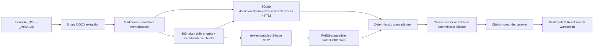

# simple-agent

A minimal LLM agent built on [LangChain Deep Agents](https://github.com/langchain-ai/deepagents). Supports OpenAI, Anthropic, and Google models out of the box. Two ways to run it — pick one:

- [CLI guide](docs/cli.md) — interactive terminal chat
- [Fullstack guide](docs/fullstack.md) — FastAPI server + React frontend

---

## Core agent

The agent lives in `src/agent/core.py` and exposes a single factory:

```python
from agent.core import make_agent

agent = make_agent(
    model_str="anthropic:claude-haiku-4-5-20251001",  # provider:model
    system_prompt=None,                                # optional override
)
```

It wraps LangChain's `init_chat_model` + `create_deep_agent` and returns a compiled LangGraph agent that supports `.invoke()`, `.stream()`, and `.astream()`.

## Supported providers

| Provider  | Model string example                            | Required env var    |
|-----------|-------------------------------------------------|---------------------|
| Anthropic | `anthropic:claude-haiku-4-5-20251001` (default) | `ANTHROPIC_API_KEY` |
| OpenAI    | `openai:gpt-4o`                                 | `OPENAI_API_KEY`    |
| Google    | `google_genai:gemini-2.5-flash`                 | `GOOGLE_API_KEY`    |

Any model supported by LangChain's [`init_chat_model`](https://python.langchain.com/docs/how_to/chat_models_universal_init/) works — just pass the `provider:model` string.

## Prerequisites

- Python 3.13+
- [uv](https://docs.astral.sh/uv/) package manager
- At least one LLM provider API key

## Initial setup

```bash
git clone https://github.com/valkai-tech/simple-agent-public.git
cd simple-agent-public
uv sync
cp .env.example .env
# Fill in your API key(s) in .env
```

## Running evals

```bash
uv run pytest evals/ -v
```

Evals make real LLM calls (not mocked) to verify provider integration end-to-end.

## Project structure

```
simple-agent/
├── README.md               # this file — core concepts
├── docs/
│   ├── cli.md              # CLI usage guide
│   └── fullstack.md        # server + frontend guide
├── pyproject.toml          # uv project config and dependencies
├── .env.example            # API key template
├── src/
│   └── agent/
│       ├── core.py         # agent factory (shared by both approaches)
│       ├── cli.py          # CLI entry point
│       └── server.py       # FastAPI server entry point
├── frontend/               # React chat UI
└── evals/
    └── test_agent.py       # pytest evals
```

## Andrew's Notes: MedAI QMS Internal Search

This branch turns the starter chat agent into an internal-search demo for the
MedAI QMS document corpus. The target production baseline intentionally
optimizes for quality before cost:

```env
EMBEDDING_MODEL=text-embedding-3-large
EMBEDDING_DIMENSIONS=3072
CHAT_MODEL=gpt-5.5
AGENT_MODEL=gpt-5.5
ENRICHMENT_MODEL=gpt-5.5
EVAL_GRADER_MODEL=gpt-5.5
QUERY_MODEL=gpt-5.4-mini
VECTOR_INDEX=faiss
FAISS_INDEX_TYPE=IndexFlatIP
CHUNK_SIZE_TOKENS=600
CHUNK_OVERLAP_TOKENS=100
RERANKER_MODEL=Qwen/Qwen3-Reranker-4B
```

Data flow:


```mermaid
flowchart LR
    Zip["Example_QMS_-_MedAI.zip"] --> Extract["Binary DOCX extraction"]
    Extract --> Normalize["Markdown + metadata normalization"]
    Normalize --> Chunk["600-token child chunks + metadata/table chunks"]
    Normalize --> SQLite["SQLite documents/chunks/revisions/references + FTS5"]
    Chunk --> Embed["text-embedding-3-large 3072"]
    Chunk --> SQLite
    Embed --> Vector["FAISS-compatible IndexFlatIP store"]
    SQLite --> Search["Deterministic query planner"]
    Vector --> Search
    Search --> Rerank["CrossEncoder reranker or deterministic fallback"]
    Rerank --> Answer["Citation-grounded answer"]
    Answer --> UI["Desktop-first React search workbench"]
```

Important build/status commands:

```bash
# Download the expensive OpenAI vector bundle from the GitHub Release asset.
curl -L https://github.com/andrewsohrabi/simple-agent-public/releases/download/qms-openai-vector-bundle-2026-05-07/qms-openai-vector-bundle-2026-05-07.tar.gz -o /tmp/qms-openai-vector-bundle-2026-05-07.tar.gz
tar -xzf /tmp/qms-openai-vector-bundle-2026-05-07.tar.gz

# Regenerate cheap local SQLite/FTS and normalized text artifacts.
uv run ingest-qms

# Only run this when the downloaded vector bundle is unavailable or intentionally being refreshed.
uv run build-qms-index

uv run build-qms-index --hash-embeddings   # deterministic local smoke index
uv run search-status --tasks TASKS.md --index-dir .data/qms-index --openai-state .data/openai/vector_store_state.json
uv run serve
cd frontend && npm run dev
```

Retrieval mode semantics are explicit:

| Mode | Semantics |
| --- | --- |
| `auto` | Hosted OpenAI File Search first when synced and healthy; falls back to local retrieval if hosted state is missing, empty, stale, or errors. |
| `hosted` | Hosted-preferred validation mode; tries hosted retrieval first and falls back to local retrieval with warnings instead of hard-failing the turn. |
| `hybrid` | Strict local SQLite FTS + FAISS-compatible dense retrieval + reranker path; never calls hosted search. This is the primary local quality/eval mode. |
| `local` | Local-only fallback/debug path; never calls hosted search. Use it to isolate SQLite/vector fallback behavior without hosted routing. |

Copy-paste CLI commands:

```bash
# Status
uv run search-status --tasks TASKS.md --index-dir .data/qms-index --openai-state .data/openai/vector_store_state.json

# Single-turn strict local hybrid search
uv run search-qms "Find BOM-055 Rev G" --mode hybrid --limit 8

# Interactive multi-turn QMS chat on strict local hybrid retrieval
uv run chat --qms-search --mode hybrid --limit 8

# Interactive auto mode: hosted first, local fallback
uv run chat --qms-search --mode auto --limit 8

# Human CLI defaults: QMS> prompt, pretty output, and dynamic progress on TTYs
uv run chat --qms-search --mode hybrid --limit 8

# Disable the dynamic spinner while keeping pretty output on an interactive terminal
uv run chat --qms-search --mode hybrid --limit 8 --no-progress

# Stable plain text for logs and copy/paste
uv run chat --qms-search --mode hybrid --limit 8 --plain

# One-turn trace output for routing/debug inspection
printf 'Find BOM-055 Rev G\nquit\n' | uv run chat --qms-search --mode hybrid --limit 8 --trace

# Raw JSON trace instead of formatted trace panels
printf 'Find BOM-055 Rev G\nquit\n' | uv run chat --qms-search --mode hybrid --limit 8 --trace --raw-trace

# One-turn full citation paths
printf 'Find BOM-055 Rev G\nquit\n' | uv run chat --qms-search --mode hybrid --limit 8 --full-citations

# Automation-friendly JSON output; suppresses prompt, progress, and Rich formatting
printf 'Find BOM-055 Rev G\nquit\n' | uv run chat --qms-search --mode hybrid --json

# Deterministic hash-embedding smoke path
uv run search-qms "Find BOM-055 Rev G" --mode hybrid --limit 8 --hash-embeddings

# Scripted multi-turn smoke with trace and full citations
printf 'Find the Bill of Materials for the MX1 system\nWhat revision is that?\nShow me the full pathname citation.\nquit\n' | uv run chat --qms-search --mode hybrid --limit 8 --trace --full-citations

# Scripted auto fallback smoke by pointing hosted state at a missing local file
printf 'Find BOM-055 Rev G\nquit\n' | OPENAI_VECTOR_STORE_STATE=/private/tmp/missing-openai-vector-store-state.json uv run chat --qms-search --mode auto --limit 8 --trace

# Strict local hybrid eval
uv run search-evals --dataset evals/datasets/qms_core.jsonl --report docs/eval-runs --mode hybrid --fail-under 0

# Hosted-first auto eval with local fallback
uv run search-evals --dataset evals/datasets/qms_core.jsonl --report docs/eval-runs --mode auto --fail-under 0
```

Interactive QMS chat uses a `QMS> ` prompt. If a pasted transcript line starts
with `You:`, `User:`, `Q:`, or `Query:`, the prefix is stripped before routing
and preserved in the trace. Human terminal sessions get Rich panels, citation
cards, grouped traces, and a progress spinner; piped/scripted runs stay stable.
Use `--json` for machine-readable output or `--plain` for deterministic text.

The current implementation includes deterministic ingestion, revision parsing,
SQLite inventory/counts plus revision/reference tables, FTS5 lookup, a
FAISS-compatible normalized OpenAI vector store, synced hosted OpenAI File
Search state, query planning, citation objects, `/search`, `/stats`, `/health`,
a desktop-first React workbench using the requested prompt-box component shape,
and an 84-case eval dataset covering the seven exercise query patterns.

Current indexed baseline:

- `189` real DOCX records represented after ignoring Mac artifacts.
- `24` sparse/empty-body documents retained as metadata-only records.
- `17,651` token-aware chunks in the OpenAI vector bundle.
- Local vectors are OpenAI `text-embedding-3-large` embeddings at `3072`
  dimensions with `embedding_provider=openai`, distributed as a GitHub Release
  asset containing `.data/qms-index/vectors.npy` and
  `.data/qms-index/vector_metadata.json`.
- SQLite/FTS artifacts are regenerated locally with `uv run ingest-qms`; they
  are intentionally not committed.
- Hosted OpenAI File Search state can be synced for the same corpus hash with
  `189` uploaded normalized Markdown files, but hosted state remains local-only.
- SQLite includes `revisions` and `doc_references`; current status reports
  `4,446` extracted references after local ingest.
- Reranking is implemented with an optional `sentence_transformers.CrossEncoder`
  backend for `Qwen/Qwen3-Reranker-4B`. This local environment does not have the
  native/model dependencies installed, so `/stats` correctly reports
  `backend=deterministic_fallback` with `warning=real_reranker_unavailable`.
- The latest 84-case local OpenAI-index eval is `84 / 84` at harness threshold
  `0`, average score `0.5812`, in `docs/eval-runs/2026-05-07-040446.md`.
  The report is intentionally candid: citation validity is `0.3773`,
  Recall@k is `0.4504`, and obsolete leakage improved to `0.3000` after the
  default obsolete-filtering pass.
- `docs/architecture-decisions.md` records chunking, table-splitting,
  metadata-only, model-baseline, artifact, and eval trade-off decisions.

Remaining production baseline:

- Install/cache the optional native reranker dependencies if the demo machine
  should run Qwen locally instead of the deterministic fallback:
  `uv sync --group native-search`. Then ensure the configured Hugging Face model
  is available in the local cache or set `RERANKER_MODEL` to a local model path.
- `gpt-5.5` answer synthesis is wired behind `ANSWER_SYNTHESIS_ENABLED=true`.
  It uses validated retrieved evidence and falls back to deterministic
  extractive answers with an explicit warning if the model call fails or returns
  unsupported citation labels.
- Playwright MCP desktop verification completed on `2026-05-07`: the app loaded
  at `http://127.0.0.1:3060`, an enumeration query ran through the UI, Sources
  and Debug opened, and the browser console showed no warnings or errors. The
  command-line Playwright suite is present, but `scripts/check.sh` skips only the
  known Codex macOS Chromium MachPort failure after backend startup and frontend
  build pass.

The hosted OpenAI File Search sync path can create and reuse a vector store
programmatically; no manual OpenAI UI setup is needed. The user only needs
`OPENAI_API_KEY` in `.env`. Hosted vector-store state is kept under
`.data/openai/` and is not committed.
