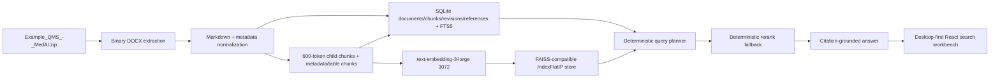

# simple-agent

A minimal LLM agent built on [LangChain Deep Agents](https://github.com/langchain-ai/deepagents). Supports OpenAI, Anthropic, and Google models out of the box. Two ways to run it — pick one:

- [CLI guide](docs/cli.md) — interactive terminal chat
- [Fullstack guide](docs/fullstack.md) — FastAPI server + React frontend

---

## Core agent

The agent lives in `src/agent/core.py` and exposes a single factory:

```python
from agent.core import make_agent

agent = make_agent(
    model_str="anthropic:claude-haiku-4-5-20251001",  # provider:model
    system_prompt=None,                                # optional override
)
```

It wraps LangChain's `init_chat_model` + `create_deep_agent` and returns a compiled LangGraph agent that supports `.invoke()`, `.stream()`, and `.astream()`.

## Supported providers

| Provider  | Model string example                            | Required env var    |
|-----------|-------------------------------------------------|---------------------|
| Anthropic | `anthropic:claude-haiku-4-5-20251001` (default) | `ANTHROPIC_API_KEY` |
| OpenAI    | `openai:gpt-4o`                                 | `OPENAI_API_KEY`    |
| Google    | `google_genai:gemini-2.5-flash`                 | `GOOGLE_API_KEY`    |

Any model supported by LangChain's [`init_chat_model`](https://python.langchain.com/docs/how_to/chat_models_universal_init/) works — just pass the `provider:model` string.

## Prerequisites

- Python 3.13+
- [uv](https://docs.astral.sh/uv/) package manager
- At least one LLM provider API key

## Initial setup

```bash
git clone https://github.com/valkai-tech/simple-agent-public.git
cd simple-agent-public
uv sync
cp .env.example .env
# Fill in your API key(s) in .env
```

## Running evals

```bash
uv run pytest evals/ -v
```

Evals make real LLM calls (not mocked) to verify provider integration end-to-end.

## Project structure

```
simple-agent/
├── README.md               # this file — core concepts
├── docs/
│   ├── cli.md              # CLI usage guide
│   └── fullstack.md        # server + frontend guide
├── pyproject.toml          # uv project config and dependencies
├── .env.example            # API key template
├── src/
│   └── agent/
│       ├── core.py         # agent factory (shared by both approaches)
│       ├── cli.py          # CLI entry point
│       └── server.py       # FastAPI server entry point
├── frontend/               # React chat UI
└── evals/
    └── test_agent.py       # pytest evals
```

## Andrew's Notes: MedAI QMS Internal Search

This branch turns the starter chat agent into an internal-search demo for the
MedAI QMS document corpus. The target production baseline intentionally
optimizes for quality before cost:

```env
EMBEDDING_MODEL=text-embedding-3-large
EMBEDDING_DIMENSIONS=3072
CHAT_MODEL=gpt-5.5
AGENT_MODEL=gpt-5.5
ENRICHMENT_MODEL=gpt-5.5
EVAL_GRADER_MODEL=gpt-5.5
QUERY_MODEL=gpt-5.4-mini
VECTOR_INDEX=faiss
FAISS_INDEX_TYPE=IndexFlatIP
CHUNK_SIZE_TOKENS=600
CHUNK_OVERLAP_TOKENS=100
RERANKER_MODEL=Qwen/Qwen3-Reranker-4B
```

Data flow:


```mermaid
flowchart LR
    Zip["Example_QMS_-_MedAI.zip"] --> Extract["Binary DOCX extraction"]
    Extract --> Normalize["Markdown + metadata normalization"]
    Normalize --> Chunk["600-token child chunks + metadata/table chunks"]
    Normalize --> SQLite["SQLite documents/chunks/revisions/references + FTS5"]
    Chunk --> Embed["text-embedding-3-large 3072"]
    Chunk --> SQLite
    Embed --> Vector["FAISS-compatible IndexFlatIP store"]
    SQLite --> Search["Deterministic query planner"]
    Vector --> Search
    Search --> Rerank["Deterministic rerank fallback"]
    Rerank --> Answer["Citation-grounded answer"]
    Answer --> UI["Desktop-first React search workbench"]
```

Important commands:

```bash
uv run ingest-qms
uv run build-qms-index
uv run build-qms-index --hash-embeddings   # deterministic local smoke index
uv run search-status --tasks TASKS.md --index-dir .data/qms-index --openai-state .data/openai/vector_store_state.json
uv run search-evals --dataset evals/datasets/qms_core.jsonl --report docs/eval-runs --hash-embeddings --mode local
uv run serve
cd frontend && npm run dev
```

The current implementation includes deterministic ingestion, revision parsing,
SQLite inventory/counts plus revision/reference tables, FTS5 lookup, a
FAISS-compatible normalized OpenAI vector store, synced hosted OpenAI File
Search state, query planning, citation objects, `/search`, `/stats`, `/health`,
a desktop-first React workbench using the requested prompt-box component shape,
and an 84-case eval dataset covering the seven exercise query patterns.

Current indexed baseline:

- `189` real DOCX records represented after ignoring Mac artifacts.
- `24` sparse/empty-body documents retained as metadata-only records.
- `7,778` token-aware chunks in the local index.
- Local vectors are OpenAI `text-embedding-3-large` embeddings at `3072`
  dimensions with `embedding_provider=openai`.
- Hosted OpenAI File Search state is synced for the same corpus hash with `189`
  uploaded normalized Markdown files.
- SQLite includes `revisions` and `doc_references`; current status reports
  `2,355` extracted references.
- Reranking is enabled but currently uses the deterministic fallback backend
  while the Qwen implementation remains a production gap.
- The latest 84-case local OpenAI-index eval is `84 / 84` at harness threshold
  `0`, average score `0.5639`, in `docs/eval-runs/2026-05-07-031242.md`.
  The report is intentionally candid: citation validity is `0.3815`,
  Recall@k is `0.4385`, and obsolete leakage needs more ranking/filter work.
- `docs/architecture-decisions.md` records chunking, table-splitting,
  metadata-only, model-baseline, artifact, and eval trade-off decisions.

Remaining production baseline:

- Complete real Qwen/BAAI reranking and `gpt-5.5` long-form synthesis if the
  demo needs model-written narrative rather than deterministic extractive
  answers.
- Playwright MCP desktop verification completed on `2026-05-07`: the app loaded
  at `http://127.0.0.1:3060`, an enumeration query ran through the UI, Sources
  and Debug opened, and the browser console showed no warnings or errors. The
  command-line Playwright suite is present, but `scripts/check.sh` skips only the
  known Codex macOS Chromium MachPort failure after backend startup and frontend
  build pass.

The hosted OpenAI File Search sync path can create and reuse a vector store
programmatically; no manual OpenAI UI setup is needed. The user only needs
`OPENAI_API_KEY` in `.env`. Hosted vector-store state is kept under
`.data/openai/` and is not committed.
